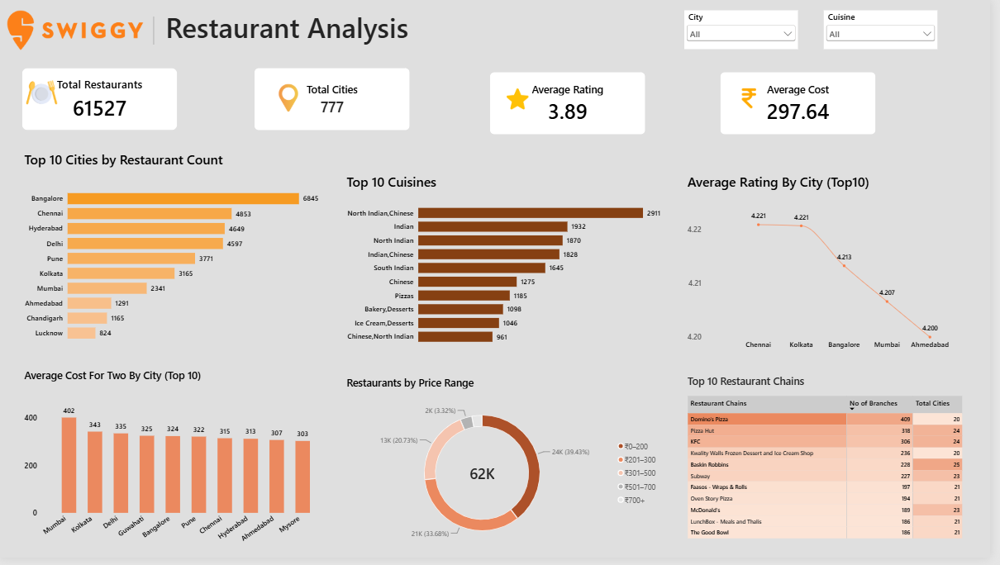

# Swiggy Restaurant Data Analysis

## 1. Project Title

Swiggy Restaurant Data Analysis

## 2. Short Description / Purpose

A SQL-based data analysis project focused on analyzing Swiggy restaurant data to understand restaurant distribution, ratings, pricing, cuisines, cities, and restaurant chain presence across India.

The project uses PostgreSQL for data cleaning, transformation, and exploratory analysis.

## 3. Tech Stack

- PostgreSQL
- SQL

## 4. Data Source

The dataset contains restaurant-level information including:

- Restaurant name
- City
- Rating
- Rating count
- Cost for two
- Cuisine
- License number
- Restaurant link
- Address
- Menu information

## 5. Features & Highlights

### Data Cleaning

- Checked total number of records
- Checked NULL values in key columns
- Removed restaurants with unavailable ratings
- Standardized restaurant ratings into numeric values
- Converted cost values into numeric format for analysis
- Handled rating count values such as "K+ ratings"

### Restaurant & City Analysis

- Number of restaurants listed by city
- Cities with more than 500 restaurants
- Cities with the highest average restaurant ratings
- Cities with the largest variety of cuisines
- Average cost for two across cities
- Best value-for-money cities based on rating and cost

### Cuisine Analysis

- Top 10 most popular cuisines
- Cuisines with the highest average ratings
- Cuisines available across the largest number of cities
- Most common cuisine in each city
- Most popular cuisine in each city based on restaurant count

### Restaurant Chain Analysis

- Top restaurant chains by number of branches
- Restaurant chains operating across multiple cities
- Restaurant chains operating in more than 10 cities
- Top 3 restaurant chains in each city
- Restaurant chain with the maximum branches in each city
- Restaurants with branch counts above the overall average

### Rating & Customer Popularity Analysis

- Restaurants with ratings above 4.5
- Restaurants with more than 1,000 ratings
- Analysis of highly rated and popular restaurants

### SQL Concepts Used

- SELECT
- WHERE
- GROUP BY
- HAVING
- ORDER BY
- LIMIT
- CASE statements
- CAST
- Aggregate functions
- Common Table Expressions (CTEs)
- Window functions
- DENSE_RANK()
- DISTINCT
- Subqueries
- String manipulation
- Regular expressions

## 6. Screenshots / Demo

### Swiggy Restaurant Analysis Dashboard

### Dashboard Highlights

- Total Restaurants: 61,527
- Total Cities: 777
- Average Rating: 3.89
- Average Cost for Two: ₹297.64
- Top 10 Cities by Restaurant Count
- Top 10 Cuisines
- Average Rating by City
- Average Cost for Two by City
- Restaurants by Price Range
- Top 10 Restaurant Chains
